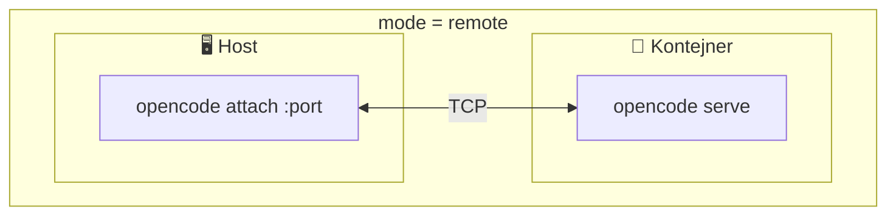
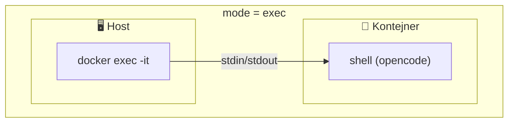

# 🔌 Access Modes

jailoc podporuje dva režimy připojení k OpenCode serveru uvnitř kontejneru:





## Remote

Spustí `opencode attach` na hostu a připojí se přes exponovaný TCP port ke kontejneru, ve kterém běží `opencode serve`.

**✅ Výhody:**

- Nativní terminálový zážitek — rendering probíhá na hostu bez latence
- Plná podpora klávesových zkratek a schránky
- Oddělení UI od agenta — je možné se odpojit a znovu připojit bez ztráty stavu

**❌ Nevýhody:**

- Vyžaduje nainstalovaný `opencode` na hostu

## Exec

Spustí `docker exec -it` přímo do kontejneru a otevře `opencode` TUI uvnitř.

**✅ Výhody:**

- Žádné závislosti na hostu — stačí Docker
- Funguje i bez síťového přístupu k portu kontejneru

**❌ Nevýhody:**

- Terminálový rendering přes docker exec — omezenější podpora klávesových zkratek
- Odpojení ukončí relaci

## Nastavení

Automatická detekce zvolí `remote`, pokud najde `opencode` na PATH, jinak použije `exec`.

V konfiguraci:

```toml
# mode = ""        # auto-detect (výchozí)
# mode = "remote"  # vždy opencode attach na hostu
# mode = "exec"    # vždy docker exec do kontejneru
```

Případně lze přepsat pro jednotlivé spuštění pomocí flagů:

```bash
jailoc              # auto-detect
jailoc --remote     # vynutit remote režim
jailoc --exec       # vynutit exec režim
```
