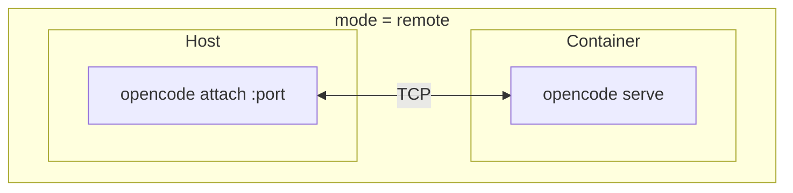
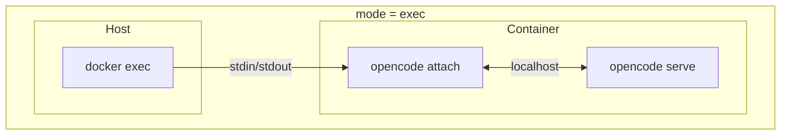

# Access Modes

When you run `jailoc attach`, you're connecting to an agent running inside a container. There are two distinct ways that connection can work, and they have meaningfully different characteristics. Understanding the difference helps you choose the right mode and explains some behaviours that might otherwise seem surprising.

## Remote mode

In remote mode, `opencode serve` runs inside the container and listens on a TCP port. On the host, `jailoc attach` calls `opencode attach` pointing at that port. The agent process and the terminal UI are in different places, connected by a network socket.

The opencode container always runs `opencode serve`. What changes between modes is whether the client is a host-side `opencode attach` or an in-container `opencode attach` piped through `docker exec`.

### Why this matters

Because the terminal UI renders on the host, it uses your host terminal directly. Keyboard shortcuts, clipboard integration, and font rendering all work exactly as they do when running opencode locally. The agent session lives in the container process, so you can disconnect and reconnect without losing state. The container keeps running, the agent keeps its context, and when you reconnect the conversation is exactly where you left it.

The only requirement is that `opencode` (or `opencode-cli`) is installed and available on your host `PATH`.

If the `opencode` container stops or is recreated while you are attached, `jailoc` cancels the host-side attach process instead of waiting indefinitely. This matters most during rebuilds or bakes that replace the container while your UI is still connected.

## Exec mode

In exec mode, `jailoc attach` uses `docker exec` to run `opencode attach` inside the container, connecting to the same `opencode serve` process. Both the client and the server run inside the container, with stdin/stdout piped through docker exec to the host terminal.

The terminal pipeline goes host stdin → docker exec → `opencode attach` (inside container) → `opencode serve` (inside container). Every keystroke travels through this chain.

### Why this matters

Because rendering happens through docker exec's pipe, terminal capabilities are limited. Some keyboard shortcuts don't reach the application correctly, and clipboard behaviour depends on how your terminal emulator handles the piped session. If you close the terminal or disconnect, the exec'd `opencode attach` client exits, but the server and its agent session keep running. You can reconnect by running `jailoc attach --exec` again.

The upside is that exec mode has no host-side dependencies. As long as Docker is available, it works. You don't need opencode installed on your machine.

Because exec mode puts your terminal into raw mode before entering `docker exec`, an interrupted container can leave the session looking frozen until the exec call returns. `jailoc` watches the specific `opencode` container instance during attach and aborts the session as soon as that container stops or is replaced, so the terminal is restored promptly.

## Comparison

| | Remote | Exec |
|---|--------|------|
| Host dependency | `opencode` or `opencode-cli` on PATH | Docker only |
| Terminal experience | Full (renders on host) | Limited (through pipe) |
| Keyboard shortcuts | Full support | Partial |
| Disconnect behaviour | Client exits, session persists | Client exits, session persists |
| Container stop/restart during attach | Attach exits instead of hanging | Attach exits instead of hanging |
| Reconnect | Yes | Yes |

## Auto-detection

When no mode is explicitly configured, jailoc detects which mode to use. It checks whether `opencode` is available on the host `PATH`, falling back to `opencode-cli` if not found. If either binary is found, it uses remote mode. If neither is found, it falls back to exec mode.

This means the default behaviour changes depending on your host environment. A machine with opencode installed gets a richer experience automatically. A machine without it still works without any configuration change.

You can override auto-detection by setting `mode` explicitly in your workspace config. This is useful if you have opencode installed but want exec mode for a specific workspace, or if you want to lock the behaviour for predictability in shared setups.

For configuration instructions, see [How-to: Access Modes](../how-to/access-modes.md). For CLI flags that affect attachment behaviour, see [CLI Reference](../reference/cli.md).
