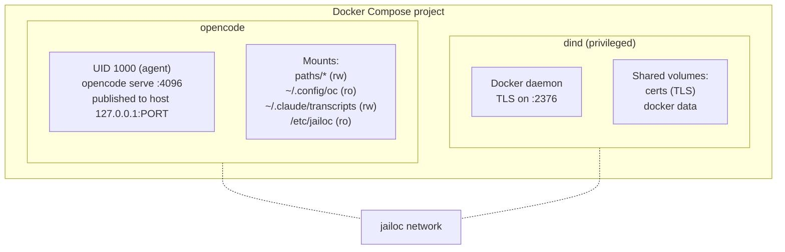

# Container Architecture

Every jailoc workspace runs as a Docker Compose project containing exactly two containers. Understanding why two containers exist, and how they interact, helps explain both the security properties and some of the operational behaviour you'll observe when working with jailoc.

## The two-container model



The **opencode container** is where the agent lives. It runs `opencode serve` as UID 1000 (a non-root user named `agent`), exposes a port bound to `127.0.0.1` on the host for attaching a terminal (not reachable from LAN or VPN), and has your workspace paths mounted read-write. Host directories are mounted into the container via configurable bind mounts — by default, your OpenCode configuration (read-only), session transcripts, and agent tooling directories. See [How-to: Configure mounts](../how-to/workspace-configuration.md#configure-mounts) for customization.

The opencode container runs with configurable resource limits. The `cpu` (default 2 cores) and `memory` (default 4 GB) settings control how much of the host's resources the container can consume, and are configurable per workspace via the TOML config. Other resource limits — `pids_limit` (256) and `mem_reservation` (512 MB) — are fixed and not configurable. Resource limit changes take effect on the next `jailoc up` invocation; running containers are not affected until restarted.

The **dind container** runs a rootless Docker daemon (`docker:dind-rootless`) in privileged mode. The entrypoint installs iptables rules as root, then drops the inheritable and bounding capability sets before execing the rootless Docker daemon as UID 1000. The daemon listens on port 2376 with mutual TLS authentication, and the certificates are shared with the opencode container via a named volume. When the agent runs `docker build` or starts a database for testing, those containers exist entirely within the dind daemon's scope and are invisible to the host. Because the daemon runs rootless, inner containers operate inside a user namespace managed by rootlesskit — even `--privileged` inner containers cannot modify the outer network namespace's iptables rules.

## Network

Both containers share a single Docker network named `jailoc`. The opencode container communicates with the dind daemon over this network via TLS on port 2376, and the same network carries the opencode container's egress traffic to the outside world. Network isolation is handled by iptables rules inside the opencode container rather than by network-level separation — see [Network Isolation](network-isolation.md) for details.

## Volume mounts

The opencode container mounts several things at startup:

| Mount | Direction | Purpose |
|-------|-----------|---------|
| Workspace paths | read-write | The directories the agent is working in |
| Configurable mounts | per-mount | Host directories mounted into the container, controlled by the `mounts` config field. Defaults include OpenCode configuration (ro), session transcripts (rw), and agent tooling (ro). See [Configuration Reference](../reference/configuration.md#mounts) for the full list and merge rules. |
| `/etc/jailoc` | read-only | jailoc's own runtime config, including allowed hosts |
| SSH agent socket | read-write | Host SSH agent forwarded into the container (when `ssh_auth_sock = true`). Also mounts `~/.ssh/known_hosts` read-only for host key verification. |
| `~/.gitconfig` | read-only | Host Git configuration (when `git_config = true`, the default) |

Two named volumes are shared between both containers: one for TLS certificates (so the opencode container can authenticate to the dind daemon) and one for Docker's data directory. A third named volume holds the agent's own data — its SQLite history database and auth tokens. This last volume is intentionally isolated from your host's `~/.local/share/opencode`, so the agent's session history never touches your personal history.

Environment variables configured via `env` or `env_file` in the workspace config or the `[defaults]` section are passed to the opencode container alongside the system variables required for dind connectivity. Values are literal strings — no host environment variable expansion is performed. jailoc also injects `JAILOC=1` and `JAILOC_WORKSPACE=<name>` into the opencode container; these are reserved and cannot be overridden by workspace config.

## The entrypoint sequence

The entrypoint script is bind-mounted into the container at runtime by jailoc and runs as root. It performs three distinct phases before handing off to the agent process.

**Phase 1: Network rules.** The script installs iptables rules that shape what the agent can reach. It inserts ACCEPT rules for the dind container, the host gateway, DNS resolver addresses (port 53 only), and any hosts or networks you've allowed in config. It appends an ACCEPT rule for TCP replies on the published service port so that port-forwarded connections from the host can complete. It then appends DROP rules for RFC 1918 address space, link-local addresses, and CGNAT ranges. Public internet traffic is untouched. See [Network Isolation](network-isolation.md) for a full explanation of the security model.

**Phase 2: Ownership fix.** Named volumes are created by Docker as root. The entrypoint runs `chown` on the data directories so UID 1000 can write to them once the privilege drop happens. If an SSH agent socket is mounted, its ownership is adjusted to UID 1000 as well. If the `~/.ssh` directory exists (from the known hosts mount), it is recursively owned to UID 1000.

**Phase 3: Privilege drop.** The entrypoint calls:

```
setpriv --reuid=1000 --regid=1000 --inh-caps=-all --no-new-privs
```

This replaces the root process with one running as UID/GID 1000, with all Linux capabilities dropped from the inheritable set and the `no_new_privs` bit set. After this point, the process cannot regain root, cannot acquire capabilities through setuid binaries, and cannot escape the iptables rules installed in phase 1 (because modifying iptables requires `CAP_NET_ADMIN`, which has been dropped).

The three-phase sequence matters because iptables manipulation and `chown` both require root, but the agent must not run as root. Running as root throughout the container's lifetime would undermine the isolation the rest of the design provides. The entrypoint acts as a controlled bootstrap that uses root only long enough to configure the environment, then discards those privileges permanently.

## Why privileged dind?

Nested Docker requires the `--privileged` flag because it needs to mount cgroups, load kernel modules, and use `overlay2` as a storage driver. There's no way around this with current Linux kernel capabilities — caps-only configurations fail when inner containers try to mount `/proc`. The tradeoff is accepted deliberately: the dind container is privileged, but it runs a rootless Docker daemon where the dockerd process and all inner containers operate as UID 1000 inside a user namespace.

The rootless architecture provides a critical security property: inner containers — even those started with `--privileged` or `--network=host` — run inside rootlesskit's user namespace and see their own isolated netfilter tables. An agent that creates a privileged inner container and attempts to flush iptables will only affect the empty netfilter inside that namespace, not the outer rules that enforce network isolation. The dind entrypoint drops all inheritable and bounding capabilities via `setpriv --inh-caps=-all --bounding-set -all` before execing the rootless daemon, so UID 1000 cannot regain `CAP_NET_ADMIN` to modify the outer iptables rules.

`--no-new-privs` is intentionally omitted from the setpriv invocation because rootlesskit requires setuid `newuidmap`/`newgidmap` for user namespace setup. These binaries are narrowly scoped — they only manipulate UID/GID mappings and cannot escalate to arbitrary capabilities.

For instructions on configuring which hosts the agent can reach, see [How-to: Network Access](../how-to/network-access.md).

## Image resolution

Before any containers start, jailoc resolves which image to run through a five-step cascade evaluated in priority order. The first step that applies wins.

A workspace `image` field short-circuits the entire cascade — Compose uses the specified image directly with no build steps. When `defaults.image` is set, it serves as the base for any workspace `dockerfile` overlay, or is used directly when no workspace Dockerfile is configured. If neither is set, jailoc falls back to a `[base].dockerfile` (local path or HTTP URL), and finally to the Dockerfile embedded in the binary.

Per-workspace `dockerfile` settings add a layer on top of the resolved base image (except when the workspace sets `image` directly, which bypasses all build steps). The workspace Dockerfile receives the base image tag as a `BASE` build argument and inherits everything from it.

For the precise resolution rules and image tag naming, see [Image Resolution Reference](../reference/image-resolution.md). For which Dockerfile instructions carry forward into overlay layers and which changes are incompatible, see [Overlay Compatibility](../reference/overlay-compatibility.md).
