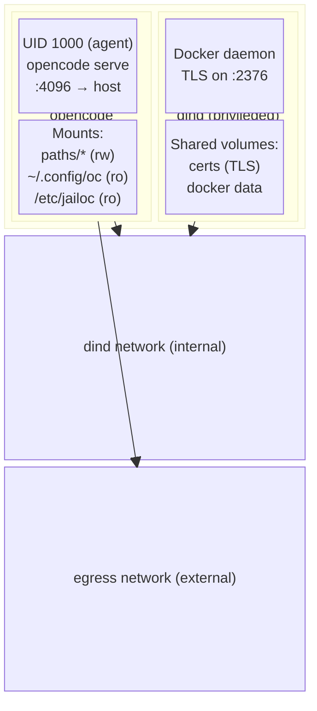

# Container Architecture

Every jailoc workspace runs as a Docker Compose project containing exactly two containers. Understanding why two containers exist, and how they interact, helps explain both the security properties and some of the operational behaviour you'll observe when working with jailoc.

## The two-container model



The **opencode container** is where the agent lives. It runs `opencode serve` as UID 1000 (a non-root user named `agent`), exposes a port to the host for attaching a terminal, and has your workspace paths mounted read-write. Your OpenCode configuration is mounted read-only so the agent inherits your API keys and settings without being able to modify them on the host.

The **dind container** runs a full Docker daemon in privileged mode. It exists solely to give the agent access to Docker without sharing the host's socket. The daemon listens on port 2376 with mutual TLS authentication, and the certificates are shared with the opencode container via a named volume. When the agent runs `docker build` or starts a database for testing, those containers exist entirely within the dind daemon's scope and are invisible to the host.

## Two networks

The Compose project attaches containers to two networks:

- The **dind network** is marked `internal: true`, meaning no host-routed traffic flows through it. It carries only the TLS connection between the opencode container and the dind daemon. Setting it internal ensures the dind daemon itself isn't reachable from outside the project.
- The **egress network** connects the opencode container to the outside world. Traffic on this network is subject to the iptables rules set up during container startup.

## Volume mounts

The opencode container mounts several things at startup:

| Mount | Direction | Purpose |
|-------|-----------|---------|
| Workspace paths | read-write | The directories the agent is working in |
| `~/.config/opencode` | read-only | Your API keys, model config, provider settings |
| `/etc/jailoc` | read-only | jailoc's own runtime config, including allowed hosts |

Two named volumes are shared between both containers: one for TLS certificates (so the opencode container can authenticate to the dind daemon) and one for Docker's data directory. A third named volume holds the agent's own data — its SQLite history database and auth tokens. This last volume is intentionally isolated from your host's `~/.local/share/opencode`, so the agent's session history never touches your personal history.

Environment variables configured via `env` or `env_file` in the workspace config or the `[defaults]` section are passed to the opencode container alongside the system variables required for dind connectivity. Values are literal strings — no host environment variable expansion is performed.

## The entrypoint sequence

The container image's entrypoint script runs as root and performs three distinct phases before handing off to the agent process.

**Phase 1: Network rules.** The script installs iptables rules that shape what the agent can reach. It inserts ACCEPT rules for the dind container, the host gateway, and any hosts or networks you've allowed in config. It then appends DROP rules for RFC 1918 address space, link-local addresses, and CGNAT ranges. Public internet traffic is untouched. See [Network Isolation](network-isolation.md) for a full explanation of the security model.

**Phase 2: Ownership fix.** Named volumes are created by Docker as root. The entrypoint runs `chown` on the data directories so UID 1000 can write to them once the privilege drop happens.

**Phase 3: Privilege drop.** The entrypoint calls:

```
setpriv --reuid=1000 --regid=1000 --inh-caps=-all --no-new-privs
```

This replaces the root process with one running as UID/GID 1000, with all Linux capabilities dropped from the inheritable set and the `no_new_privs` bit set. After this point, the process cannot regain root, cannot acquire capabilities through setuid binaries, and cannot escape the iptables rules installed in phase 1 (because modifying iptables requires `CAP_NET_ADMIN`, which has been dropped).

The three-phase sequence matters because iptables manipulation and `chown` both require root, but the agent must not run as root. Running as root throughout the container's lifetime would undermine the isolation the rest of the design provides. The entrypoint acts as a controlled bootstrap that uses root only long enough to configure the environment, then discards those privileges permanently.

## Why privileged dind?

Nested Docker requires the `--privileged` flag because it needs to mount cgroups, load kernel modules, and use `overlay2` as a storage driver. There's no way around this with current Linux kernel capabilities. The tradeoff is accepted deliberately: the dind container is privileged, but it's on an internal network, has no access to host paths, and its daemon is only reachable from the opencode container over mutual TLS.

For instructions on configuring which hosts the agent can reach, see [How-to: Network Access](../how-to/network-access.md).

## Image resolution

Before any containers start, jailoc resolves which image to run through a five-step cascade evaluated in priority order. The first step that applies wins.

A workspace `image` field short-circuits the entire cascade — Compose uses the specified image directly with no build steps. When `defaults.image` is set, it serves as the base for any workspace `dockerfile` overlay, or is used directly when no workspace Dockerfile is configured. If neither is set, jailoc falls back to a `[base].dockerfile` (local path or HTTP URL), and finally to the Dockerfile embedded in the binary.

Per-workspace `dockerfile` settings add a layer on top of the resolved base image (except when the workspace sets `image` directly, which bypasses all build steps). The workspace Dockerfile receives the base image tag as a `BASE` build argument and inherits everything from it.

For the precise resolution rules and image tag naming, see [Image Resolution Reference](../reference/image-resolution.md). For which Dockerfile instructions carry forward into overlay layers and which changes are incompatible, see [Overlay Compatibility](../reference/overlay-compatibility.md).
