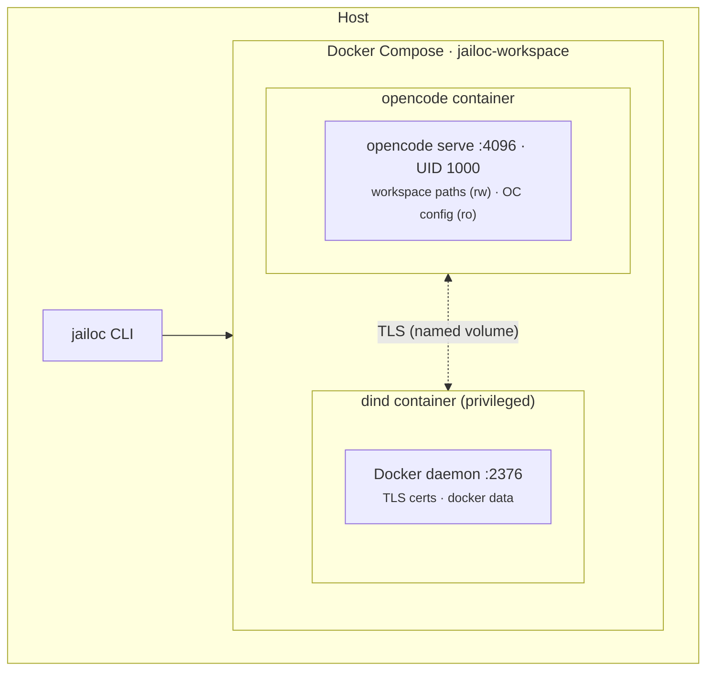

# jailoc

`jailoc` manages sandboxed Docker Compose environments for headless OpenCode coding agents. Each workspace gets its own isolated container with network restrictions and privilege dropping, so agents run autonomously without touching your host system.

## How it works

**Entrypoint** — the container starts as root, applies iptables rules, and chowns the data volume. It then drops to UID 1000 (`agent`) via `setpriv --inh-caps=-all --no-new-privs` and starts the OpenCode server.

**Volume mounts** — workspace paths are bind-mounted at the same absolute path as on the host. OpenCode config directories (`~/.config/opencode`, `~/.opencode`, `~/.claude`, `~/.agents`) are mounted read-only. A named volume holds the OpenCode data directory, so the agent's database and auth tokens stay isolated from the host.

**Network isolation** — iptables rules block all RFC 1918, link-local, and CGNAT ranges by default. You explicitly allow the specific internal hosts or networks the agent needs to reach.

## Documentation

### Get started

New to jailoc? Start here.

- [Getting Started](tutorials/getting-started.md) — install jailoc and run your first workspace

### How-to guides

Task-oriented guides for common operations.

- [Installation](how-to/installation.md)
- [Workspace Configuration](how-to/workspace-configuration.md)
- [Custom Images](how-to/custom-images.md)
- [Network Access](how-to/network-access.md)
- [Access Modes](how-to/access-modes.md)

### Reference

Complete technical descriptions of CLI commands and configuration options.

- [CLI Reference](reference/cli.md)
- [Configuration Reference](reference/configuration.md)
- [Image Resolution](reference/image-resolution.md)
- [Overlay Compatibility](reference/overlay-compatibility.md)

### Explanation

Background reading on how jailoc works and why it's designed the way it is.

- [Overview](explanation/overview.md)
- [Container Architecture](explanation/container-architecture.md)
- [Network Isolation](explanation/network-isolation.md)
- [Access Modes](explanation/access-modes.md)

### Development

- [Contributing & Development](development.md)
