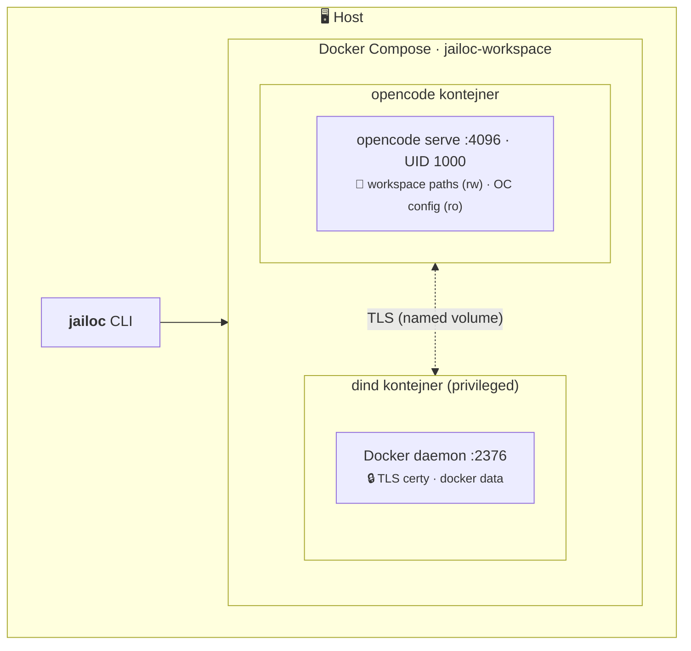

# jailOC

Spravuj sandboxovaná Docker Compose prostředí pro headless OpenCode coding agenty.

## 🤔 Co to je?

`jailoc` zabalí OpenCode agenty do izolovaných Docker kontejnerů, takže můžou běžet autonomně bez toho, aby se dotýkaly tvého hostitelského systému. Každý workspace dostane vlastní sandboxované prostředí s network isolation, která defaultně blokuje privátní sítě — ty pak přesně určíš, na které interní služby agent dosáhne. Nakonfiguruješ, které adresáře se mountují jako workspacy, které hosty jsou na allowlistu, a agent běží uvnitř s tvou OpenCode konfigurací připojenou read-only.

## ⚙️ Jak to funguje

**🚪 Entrypoint** — kontejner nastartuje jako root, nastaví iptables pravidla a provede chown datového volume. Pak přejde na UID 1000 (`agent`) přes `setpriv --inh-caps=-all --no-new-privs` a spustí OpenCode server.

**💾 Volume mounts** — cesty workspaců jsou bind-mountované na původní absolutní cestě (cesta na hostu = cesta v kontejneru). Konfigurační adresáře OpenCode (`~/.config/opencode`, `~/.opencode`, `~/.claude`, `~/.agents`) jsou mountované read-only. Izolovaný named volume obsahuje datový adresář OpenCode, takže agentova databáze a auth tokeny zůstávají oddělené od hostu.
