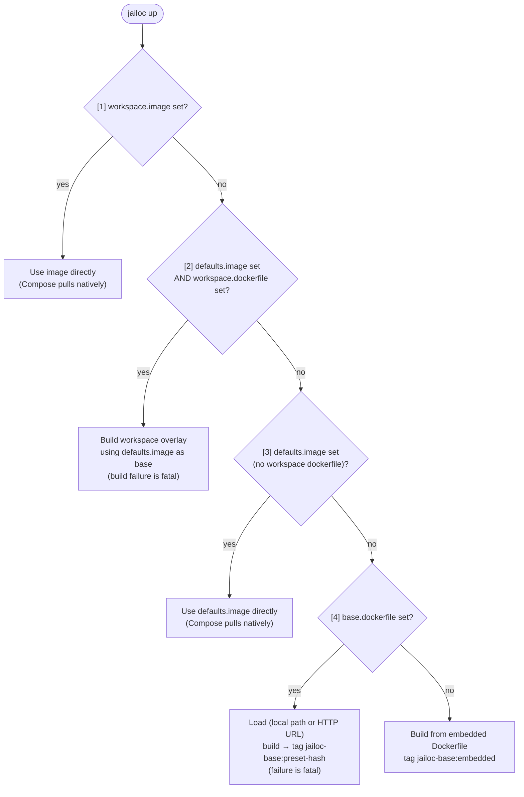
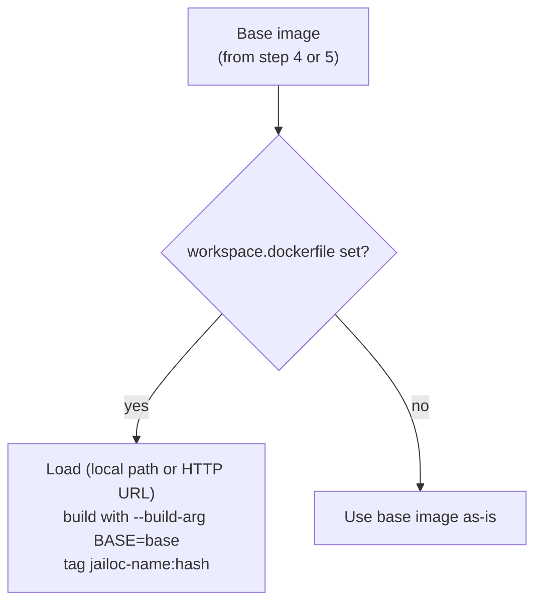

# Image Resolution Reference

During `jailoc up`, the container image is resolved through a cascade of up to five steps evaluated in priority order. The first step that applies wins; all later steps are skipped.

---

## Resolution Cascade



---

## Step Details

### Step 1: Workspace image (direct use)

**Trigger:** `image` is set in `[workspaces.<name>]`.

**Behavior:**
- The specified image is written directly into the generated `docker-compose.yml`.
- Compose pulls the image from its registry at container startup — no explicit pull call is made by jailoc.
- No build steps run. `dockerfile` and `build_context` are not consulted.

**Constraints:**
- `image` cannot be combined with `dockerfile` or `build_context` in the same workspace block. Setting both is a validation error at config load time.

---

### Step 2: Defaults image with workspace overlay build

**Trigger:** `image` is set in `[defaults]`, and `dockerfile` is set in `[workspaces.<name>]`.

**Behavior:**
- The workspace Dockerfile is loaded from the specified source (local path or HTTP URL).
- An overlay image is built on top of `defaults.image`, passed as the `BASE` build argument. Host proxy environment variables are forwarded as build arguments automatically.
- The workspace Dockerfile must begin with:

  ```dockerfile
  ARG BASE
  FROM ${BASE}
  ```

- Tags the result as `jailoc-{name}:<content-hash>`, where `<content-hash>` is the first 8 characters of the SHA-256 hash of the Dockerfile content.

**Build context:**
- If `build_context` is set in the workspace, that directory is used.
- If `build_context` is empty and `dockerfile` is a local path, the parent directory of the Dockerfile is used.
- If `build_context` is empty and `dockerfile` is an HTTP URL, a temporary directory is used.

**Constraints:**
- Build failure is fatal. There is no fallback.
- Maximum download size for HTTP Dockerfile sources: 1 MiB.

---

### Step 3: Defaults image (direct use)

**Trigger:** `image` is set in `[defaults]`, and `dockerfile` is not set in the workspace.

**Behavior:**
- The `defaults.image` value is written directly into the generated `docker-compose.yml`.
- Compose pulls the image from its registry at container startup — no explicit pull call is made by jailoc.
- No build steps run.

---

### Step 4: Base Dockerfile (custom base build)

**Trigger:** `dockerfile` is set in `[base]`, and no workspace `image` or `defaults.image` is configured.

**Behavior:**
- Loads the Dockerfile from the specified source (local path or HTTP URL).
- Builds a local image from the loaded content.
- Tags the result as `jailoc-base:preset-<content-hash>`, where `<content-hash>` is the first 8 characters of the SHA-256 hash of the Dockerfile content.

After this step, a workspace `dockerfile` (if set) is still applied as an overlay on top of the built base.

**Proxy support:** Host proxy environment variables (`HTTP_PROXY`, `HTTPS_PROXY`, `NO_PROXY`, `FTP_PROXY`, `ALL_PROXY`, and lowercase variants) are forwarded as build arguments automatically.

**Constraints:**
- Accepted sources: absolute local paths (`/...`), tilde paths (`~/...`), HTTP(S) URLs.
- Maximum download size for HTTP sources: 1 MiB. Files exceeding this limit cause a fatal error.
- Load or build failure is fatal. There is no fallback to the embedded image.
- See [Configuration Reference](configuration.md#dockerfile-fields) for accepted formats and validation rules.

---

### Step 5: Embedded fallback

**Trigger:** None of the above steps apply.

**Behavior:**
- Builds an image from the Dockerfile embedded in the jailoc binary at compile time.
- Tags the result as `jailoc-base:embedded`.

This step always succeeds (assuming a functional Docker daemon), as the Dockerfile is bundled with the binary.

**Proxy support:** Host proxy environment variables (`HTTP_PROXY`, `HTTPS_PROXY`, `NO_PROXY`, `FTP_PROXY`, `ALL_PROXY`, and lowercase variants) are forwarded as build arguments automatically.

After this step, a workspace `dockerfile` (if set) is applied as an overlay on top of the embedded base.

---

### Workspace overlay (steps 4 and 5 only)

When the cascade reaches step 4 or 5, a workspace `dockerfile` is applied as an additional layer on top of the resolved base image. Steps 1, 2, and 3 handle the workspace Dockerfile themselves (or bypass it entirely) and do not reach this stage. Host proxy environment variables are forwarded as build arguments alongside `BASE`.



---

## Image Tag Summary

| Source | Tag |
|--------|-----|
| Workspace `image` (direct) | unchanged (Compose uses as-is) |
| `defaults.image` with workspace overlay | `jailoc-{name}:<content-hash>` |
| `defaults.image` (direct) | unchanged (Compose uses as-is) |
| `[base].dockerfile` (local or HTTP) | `jailoc-base:preset-<content-hash>` |
| Embedded fallback | `jailoc-base:embedded` |
| Workspace overlay (on top of step 4/5) | `jailoc-{name}:<content-hash>` |

---

See the [custom images how-to](../how-to/custom-images.md) for practical instructions on each resolution step.
